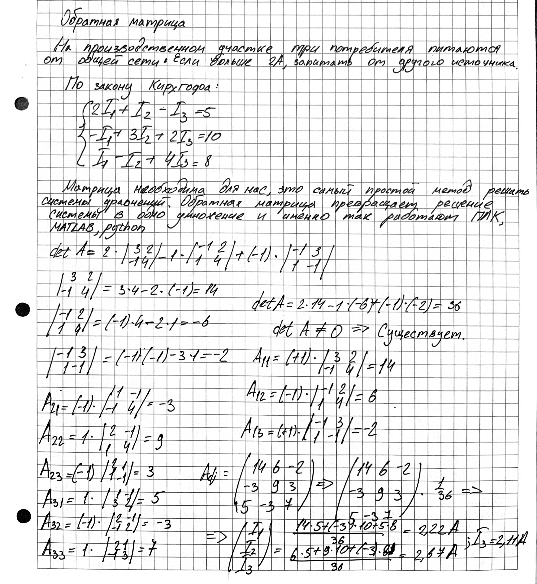

# Математические косяки
## Обратная матрица, решение



**Задача:** расчёт токов в цепи через обратную матрицу.
**Метод:** алгебраические дополнения.
**Результат:** $I_1 = 2{,}22$ А, $I_2 = 2{,}67$ А, $I_3 = 2{,}11$ А.

## Производная и функции нескольких переменных


**Задача:** охлаждение комнаты льдом.
**Метод:** частные производные по массе и времени.
**Результат:** точка насыщения — 24 кг льда.

## Множества


**Задача:** логика аварийной блокировки робота.

## Умножение на число


## Производная и интеграл


## Линейная алгебра

```python
import numpy as np
import matplotlib.pyplot as plt
from PIL import Image

# ---------- 1. Загрузка изображения ----------
img = Image.open("image.jpg").convert("RGB")
A = np.array(img, dtype=np.float64)
m, n, _ = A.shape
print(f"Размер изображения: {m} x {n}")

# ---------- 2. Функция SVD-сжатия одного канала ----------
def svd_compress_channel(channel, k):
    U, S, Vt = np.linalg.svd(channel, full_matrices=False)
    Uk = U[:, :k]
    Sk = np.diag(S[:k])
    Vtk = Vt[:k, :]
    return Uk @ Sk @ Vtk

# ---------- 3. Сжатие цветного изображения ----------
def svd_compress_color(image, k):
    result = np.zeros_like(image)
    for c in range(3):
        result[:, :, c] = svd_compress_channel(image[:, :, c], k)
    return np.clip(result, 0, 255).astype(np.uint8)

# ---------- 4. Сравнение для разных k ----------
ks = [5, 20, 50, 100]
plt.figure(figsize=(15, 10))

plt.subplot(2, 3, 1)
plt.imshow(A.astype(np.uint8))
plt.title("Оригинал")
plt.axis("off")

for i, k in enumerate(ks):
    compressed = svd_compress_color(A, k)
    plt.subplot(2, 3, i + 2)
    plt.imshow(compressed)
    plt.title(f"k = {k}")
    plt.axis("off")

plt.tight_layout()
plt.show()

# ---------- 5. Оценка степени сжатия и ошибки ----------
def compression_stats(image, k):
    m, n, _ = image.shape
    original_size = m * n * 3
    compressed_size = 3 * k * (m + n + 1)
    ratio = original_size / compressed_size

    error = 0
    for c in range(3):
        U, S, Vt = np.linalg.svd(image[:, :, c], full_matrices=False)
        error += np.sum(S[k:] ** 2)
    error = np.sqrt(error)
    return ratio, error

for k in ks:
    ratio, error = compression_stats(A, k)
    print(f"k = {k:3d} | Сжатие: {ratio:6.2f}x | Ошибка Фробениуса: {error:10.2f}")
```


